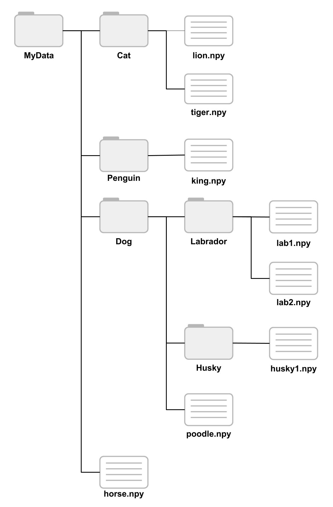

# DataStore

Use a DataStore object to manage a collection of data files, where each individual file fits in memory, but the entire collection does not necessarily fit. Currently there are four DataStore types (in addition to the base DataStore class):

* `NumpyDataStore`: For `.npy` Numpy files
* `MatlabDataStore`: For `.mat` Matlab files
* `HDF5DataStore`: For HDF5 (`.h5`) files and Matlab v7.3 data.
* `ImageDataStore`: For image data. This can read `.jpg`, `.png`, `.tif`, `.bmp` files.


## Requirements

The following packages are required for DataStore to work:

* Numpy
* Scipy
* h5py
* ImageIO


## Example

### Initializing the DataStore

DataStore objects assume that data file are organized in a tree-like structure. In this example, we will read the `.npy` files in the tree below:



Since these are Numpy `.npy` files, we can store the data in a `NumpyDataStore` object.

```python
from datastore import NumpyDataStore

ds = NumpyDataStore('MyData', include_subdirectories=True)
```

Here, we have passed the `NumpyDataStore` object the root directory for our file tree, and we have set `include_subdirectories=True`. As a result the DataStore will search all of the subdirectories for Numpy files. Each subdirectory is considered as a separate class of data, and the name of the subdirectory corresponds to the name of the class. Files in the root directory also form a class of data. In our example file tree above, we have the following classes:

* MyData
* Cat
* Dog
* Husky
* Labrador
* Penguin

### Loading data
Once the DataStore has been initialized, there are several methods for loading data:

* `data, labels = ds.load()`: Load all the data and their corresponding labels. Both `data` and `labels` are lists, unless there is only one file to load.
* `data, labels = ds.load(label=['Cat','Penguin'], ind=[0,1])`: Load specific classes and data. This example will load the data with indices 0 and 1 from the Cat and Penguin classes.
* `data = ds['Husky'][0]`: Load a single datum from a particular class.
