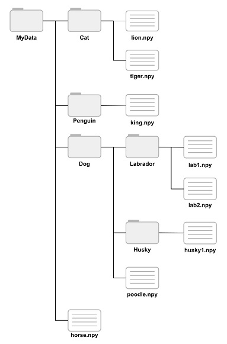

# How to use DataStore

Use a DataStore object to manage a collection of data files, where each individual file fits in memory, but the entire collection does not necessarily fit.

DataStore objects assume that data are organized in the following manner:

